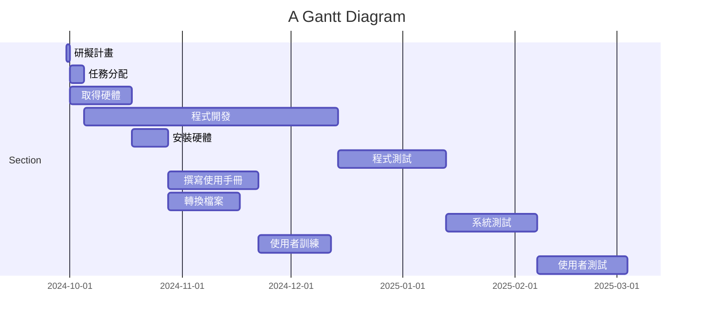

### Mermaid

&nbsp;
&nbsp;

mermaid
graph TD;
    A[編號1:研擬計劃 開始: 2024-09-30 結束: 2024-09-30] -->|1天| B[編號2:任務分配 開始: 2024-09-30 結束: 2024-10-04];
    A -->|1天| C[編號3:取得硬體 開始: 2024-09-30 結束: 2024-10-17];
    B -->|4天| D[編號4:程式開發 開始: 2024-10-05 結束: 2024-12-26];
    C -->|17天| E[編號5:安裝硬體 開始: 2024-10-18 結束: 2024-10-27];
    D -->|70天| F[編號6:程式測試 開始: 2024-12-27 結束: 2025-01-25];
    E -->|10天| G[編號7:撰寫使用手冊 開始: 2024-10-28 結束: 2024-12-01];
    E -->|20天| H[編號8:轉換檔案 開始: 2024-10-28 結束: 2024-12-15];
    F -->|30天| I[編號9:系統測試 開始: 2025-01-26 結束: 2025-02-25];
    G -->|25天| J[編號10:使用者訓練 開始: 2024-12-02 結束: 2024-12-26];
    H -->|20天| J;
    I -->|25天| K[編號11:使用者測試 開始: 2025-02-26 結束: 2025-03-02];
    J -->|20天| K;

    style A fill:#ffcccc,stroke:#333,stroke-width:2px;
    style D fill:#ffcccc,stroke:#333,stroke-width:2px;
    style F fill:#ffcccc,stroke:#333,stroke-width:2px;
    style I fill:#ffcccc,stroke:#333,stroke-width:2px;
    style K fill:#ffcccc,stroke:#333,stroke-width:2px;

關鍵路徑 1>2>4>6>9>11

